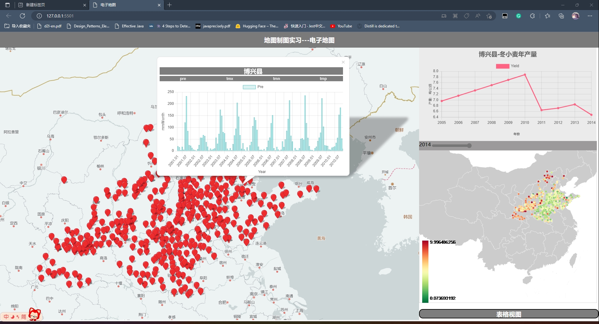
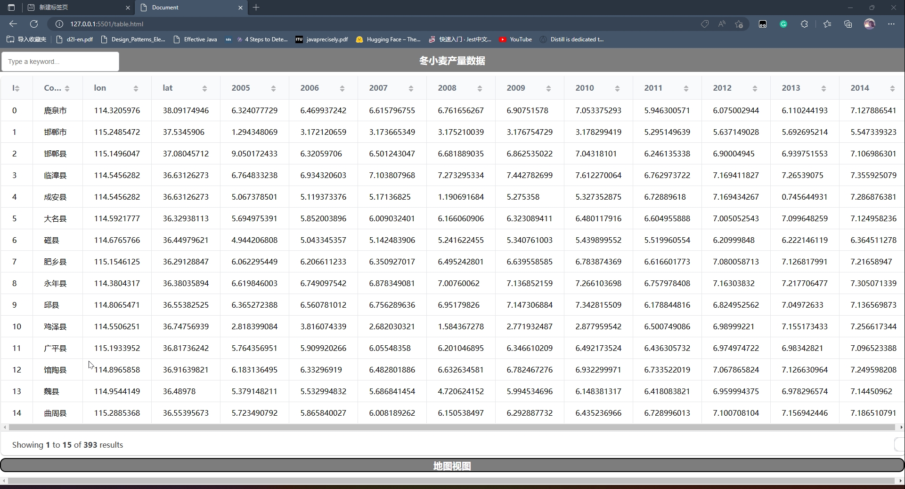
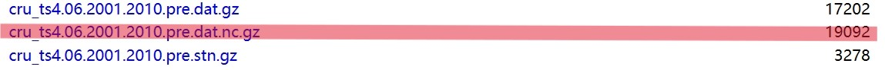
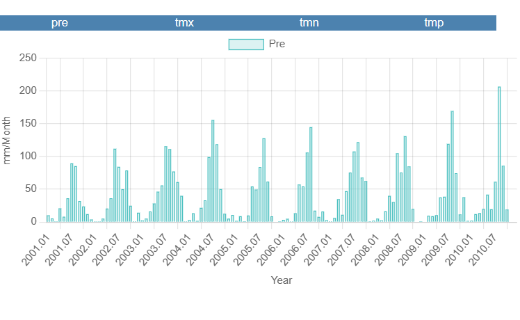
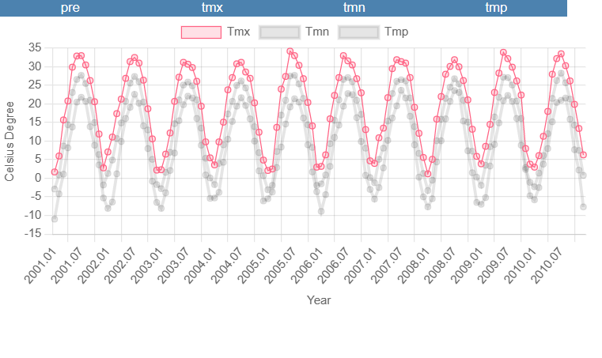
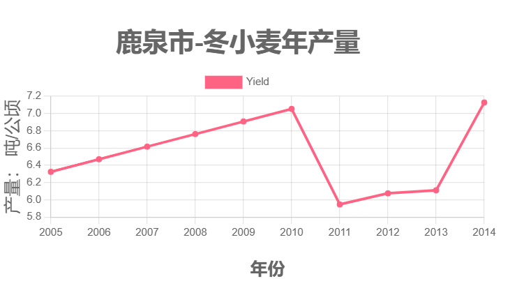

# 制图说明书

> 项目地址：
> * 数据处理：https://github.com/pzq123456/DTZT
> * 电子地图部分：https://github.com/pzq123456/DTZTdist
> * 电子地图示例访问地址：https://pzq123456.github.io/DTZTdist/

## 制图成果（电子地图）
1. 主界面

> 其中：主界面右下角的小地图可以通过鼠标拖动，实现历年产量的动态渲染。并且还编写了简单的动画效果，使得地图的渲染更加生动
2. 数据视图

## 数据处理成果
### 文件架结构说明
1. 所有数据均在dataset文件夹下

    > 注意：所有文件中的索引均从0开始，且都遵循相同相同的顺序。
    ```
    dataset/
    ├── dataset.zip
    ├── county.csv
    ├── yield.csv
    ├── label.txt
    ```
    >具体内容: https://github.com/pzq123456/DTZT/dataset/

2. 有关 `dataset.zip` 的若干说明：
   * `dataset.zip` 组织结构：
    ```
    dataset.zip/
    ├── 0.csv
    ├── 1.csv
    ├── 2.csv
    ...
    ├── 392.csv
    ```
    * `dataset.zip` 中的 `0.csv`、`1.csv`、`2.csv`、...、`392.csv` 为每个县的历史气象数据，由 [CRU](https://crudata.uea.ac.uk/cru/data/hrg/cru_ts_4.06/cruts.2205201912.v4.06/) 提供。具体组织结构：
    ``` csv
    (month:) 1,2,3,4,5,6,7,8,9,10,11,12 in 2005 and so on until 2010
    (Pre:) xxx,xxx,xxx,xxx,xxx,xxx,xxx,xxx,xxx,xxx,xxx,xxx ...
    (Tmp:) xxx,xxx,xxx,xxx,xxx,xxx,xxx,xxx,xxx,xxx,xxx,xxx ...
    (Tmx:) xxx,xxx,xxx,xxx,xxx,xxx,xxx,xxx,xxx,xxx,xxx,xxx ...
    (Tmn:) xxx,xxx,xxx,xxx,xxx,xxx,xxx,xxx,xxx,xxx,xxx,xxx ...
    ```
    其中：
    * - 括号内值并不实际存在，仅为说明。
    * - 第一行本不必添加，但为了后续某些操作的方便，添加了一行作为表头。
    * - `Pre` 为降水量，单位为 mm。
    * - `Tmp` 为平均气温，单位为 ℃。
    * - `Tmx` 为最高气温，单位为 ℃。
    * - `Tmn` 为最低气温，单位为 ℃。
    * `dataset.zip`与 `label.txt` 一一对应，构成了训练及验证模型的数据集。

3. `yield.csv` ：该文件包括每个县的冬小麦历年产量数据（2005～2014）、县名以及经纬度。示意格式如下：

    |ID|County|lon|lat|2005|2006|...|2014|
    |--|--|--|--|--|--|--|--|
    |0|鹿泉市|114.3205976|38.09174946|6.324077729|6.469937242|...|7.127886541|
    |1|邯郸市|114.1950003|38.25999921|6.324077729|6.469937242|...|7.127886541|
    |2|邯郸县|114.5250001|37.76699829|6.324077729|6.469937242|...|7.127886541|
    |...|...|...|...|...|...|...|...|

   * `ID` 为县的编号，从0开始。方便起见，本次实验所有成果均遵循此编号。
   * 产量单位为 `吨/公顷` 。
   * 由于统一编号，所以可以将本表格作为元数据。
   * 经纬度数据由 `百度地图api` 提供，具体数据请求过程见下文。

4. `county.csv`： 为中间数据，由 `yield.csv` 生成。可忽略。
### 数据使用建议
1. 首先读取 `yield.csv` 中的 `ID`、`County`、`lon`、`lat` 信息，将其作为元数据。
    ``` python
    import pandas as pd
    df = pd.read_csv('yield.csv')
    df = df[['ID', 'County', 'lon', 'lat']]
    df.to_csv('county.csv', index=False)
    ```

2. 然后根据这些元数据生成访问 `dataset.zip` 的索引，即 `dataset.zip` 中的 `0.csv`,`1.csv`,`2.csv`,...,`392.csv`。
    ``` python
    import pandas as pd
    df = pd.read_csv('county.csv')
    df['path'] = df['ID'].apply(lambda x: str(x) + '.csv')
    df.to_csv('county.csv', index=False)
    ```

3. 最后将获取到的数据进行处理，得到最终的数据集。例如与 `Pytorch` 的 `dataset类` 配合使用：
    ``` python
    class MyDataset(Dataset):
        def __init__(self, data, label):
            self.data = data
            self.label = label
        def __getitem__(self, index):
            return self.data[index], self.label[index]
        def __len__(self):
            return len(self.data)
    ```

## 制图过程
### 1. 数据获取
> 大市名及对应编码由政府文件提供，经纬度由百度地图api提供。

>   `！注意` 有关坐标偏移的声明：
> * 百度地图坐标存在偏移（数百米左右）
> * 百度地图api提供的官方坐标反算接口并不支持火星坐标向WGS84坐标的转换, 且一次请求最多只能转换10个坐标点。
> * 考虑到相对于某一县的大小，偏移量并不会对预测产生太大影响，所以我们直接使用百度地图api提供的坐标。
1. 下载 `yield.csv` (原本不包含经纬度信息)，并利用 `百度地图api` 获取经纬度信息。

    ``` javascript
        //  硬编码部分
        const DQDMlist = [130185,130401,130421,...]
        // 地名列表 与上面的行政区划列表一一对应
        const NameList = ["鹿泉市","邯郸市","邯郸县",...]
        const provinceCodeList = [1301,1302,13,...]
        const provinceNameList = ["石家庄市","唐山市",...]

        //  代码部分

        // 初始化

        // 根据行政区划编码获取大市名称 因为 百度地图 api 的地址查询功能必须要指定大市！
        // 例如：130185 -> 石家庄市
        function getCityName(code,mylist,nameList){
            // 代码转换
            // 130185 -> 1301
            let tmp = code.toString();
            let tmp2 = tmp.substring(0,4);
            tmp2 = parseInt(tmp2,10);
            let index = mylist.indexOf(tmp2);
            return nameList[index];
        }

        // 根据行政区划编码获取经纬度
        function getLonLat(code){
            // 封装 百度地图 api 的地址查询功能 略
        }

        for(let i = 0;i < DQDMlist.length;i++){
            let code = DQDMlist[i];
            let name = NameList[i];
            let cityName = getCityName(code,provinceCodeList,provinceNameList);
            let lonlat = getLonLat(code);
            // 保存到文件
        }
    ```
2. 下载历史气象数据包括: `Pre`, `Tmn`, `Tmx`, `Tmp`([CRU](http://www.cru.uea.ac.uk/cru/data/hrg/) 网站获取)
    
    
    * 下载`*.nc`格式的数据(NetCDF---Network Common Data Form)，并使用 `netCDF4` python 库处理。

    > `netCDF4` 是一个用于科学数据处理的python库，它可以读取和写入NetCDF格式的文件。

   * 读取数据
    ``` python
    import netCDF4 as nc
    import numpy as np
    import pandas as pd
    import os

    # 读取数据
    def readData():
        f1 = 
        netCDF4.Dataset('data/cru_ts4.06.2001.2010.pre.dat.nc')
        # ...
        pre = f1.variables['pre'] # 逐月降水量 10年
        # ...
        return pre,tmp,tmx,tmn,lat,lon
    ```

   * 根据元数据 读取经纬度信息并保存为csv文件

    ``` python
    def process():
        pre,tmp,tmx,tmn,lat,lon= readData()
        metadata = readMetadata()
        for i in range(0,len(metadata)):
            lat,lon = getLocation()
            latIndex,lonIndex = getLocIndex()
            data = pre[:,latIndex,lonIndex]
            # ...
            saveData(data,str(i))
    ```

   * 关于 `NetCDF` 文件的一些说明
   * - 本实验中，`NetCDF` 文件是覆盖全球的、0.5° * 0.5°的网格数据，每个网格包含了120 月的数据。
   * - 每个格网都有唯一的二维索引表示。
   * - 我们需要的是每个县的数据，所以需要根据经纬度信息，反查出对应的索引。
   * - 这个反求索引的函数需要自己编写。

### 电子地图制作
1. 数据小组件开发
> 基于 `Chart.js`, `D3.js` 等开源库，开发了一些简单的数据小组件，用于在地图右侧预览数据。
> * 围绕本项目开发的系列小组件将在报告结束的两周内封装成一个独立的库，并集成到`RVGeo.js` 库中。本次报告中只展示了其中的两个小组件。
> * 在产量分布渲染中，`2.0`版本的网页地图使用了 `RVGeo.js` 中的颜色线性映射函数。

`实现思路`:
* 考虑到通用性，小组件采用 `WebComponent` 的方式开发。将数据获取、数据处理、数据展示封装在一个原生的 `HTML` 标签中，方便在地图中调用。
* 某地 `[Pre, Tmn, Tmx, Tmp]` 系列数据的折线图小组件：
    * 
    * 点击蓝色按钮即可切换渲染视图:
    * 
* 某地历年冬小麦产量的折线图小组件： 
    * 

## 附录
### 有关电子地图与实际制图不符的若干说明：
- 主观：个人水平原因，无法做到与实际制图完全一致。

- 客观：
* - 两种地图在与用户交互方式上有所不同，电子地图动态渲染所需的数据，较为灵活多样。
* - 而纸质地图的表现相对受到限制，故而只是简单整饰了结果图。

> !警告：
> * 本项目中的数据仅供学习交流使用，不得用于实际生产。


