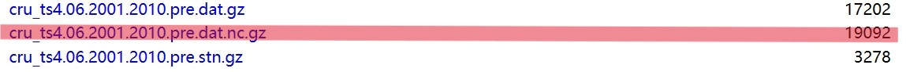
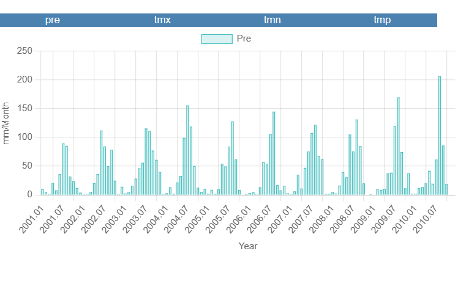
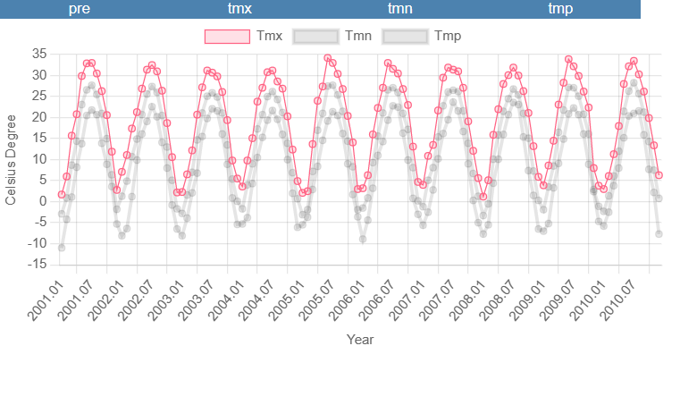
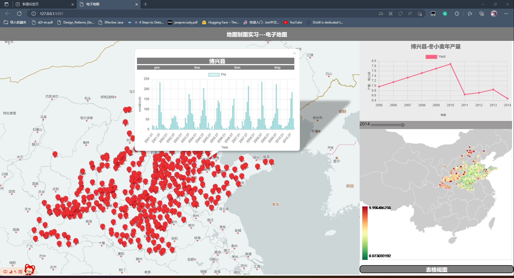
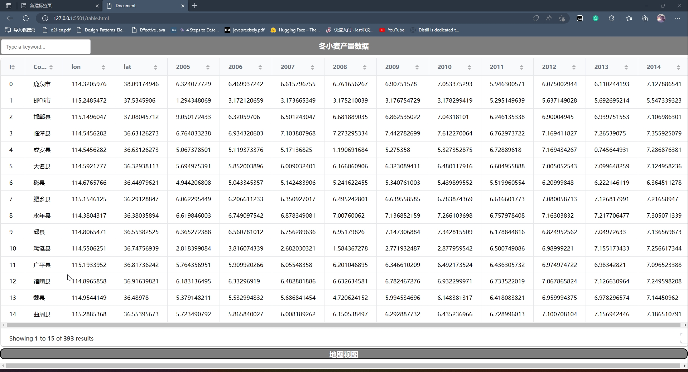

# 制图说明书
> 潘志清 地信20-2 202001020717

## Table of contents
- [制图说明书](#制图说明书)
  - [Table of contents](#table-of-contents)
  - [**一、使用说明**](#一使用说明)
    - [1.结果数据使用说明](#1结果数据使用说明)
      - [1.1. 数据成果及组织结构](#11-数据成果及组织结构)
      - [1.2. 数据使用说明](#12-数据使用说明)
    - [2.地图制图使用说明](#2地图制图使用说明)
      - [2.1.二维地图使用说明](#21二维地图使用说明)
      - [2.2.网页地图使用说明](#22网页地图使用说明)
  - [**二、设计报告**](#二设计报告)
    - [1. 数据获取、处理与预测](#1-数据获取处理与预测)
      - [1.1. 数据获取及预处理](#11-数据获取及预处理)
      - [1.2. 简单的模型预测(MLP)](#12-简单的模型预测mlp)
    - [2.地图制图设计报告](#2地图制图设计报告)
      - [2.1.二维地图设计报告(焦小梅 高云龙)](#21二维地图设计报告焦小梅-高云龙)
      - [2.2. 三维地图设计报告(覃仕锋 潘志清)](#22-三维地图设计报告覃仕锋-潘志清)
        - [2.2.1.  `Cesium` 渲染粮食产量数据的变化情况](#221--cesium-渲染粮食产量数据的变化情况)
        - [2.2.2. `Cesium-chart` 通过 `pick()` 方法拾取点的各种属性](#222-cesium-chart-通过-pick-方法拾取点的各种属性)
        - [2.2.3. 交互式气象及历年产量数据的可视化](#223-交互式气象及历年产量数据的可视化)
      - [2.3. 电子地图（优化细节、完善功能）略](#23-电子地图优化细节完善功能略)
  - [三、附录 \* Appendix](#三附录--appendix)


<br>

---


## **一、使用说明**
### 1.结果数据使用说明
#### 1.1. 数据成果及组织结构
1. 所有数据均在dataset文件夹下

    > 注意：所有文件中的索引均从0开始，且都遵循相同相同的顺序。
    ```
    dataset/
    ├── dataset.zip
    ├── county.csv
    ├── yield.csv
    ├── label.txt
    ```
    >具体内容: https://github.com/pzq123456/DTZT/dataset/

2. 有关 `dataset.zip` 的若干说明：
   * `dataset.zip` 组织结构：
    ```
    dataset.zip/
    ├── 0.csv
    ├── 1.csv
    ├── 2.csv
    ...
    ├── 392.csv
    ```
    * `dataset.zip` 中的 `0.csv`、`1.csv`、`2.csv`、...、`392.csv` 为每个县的历史气象数据，由 [CRU](https://crudata.uea.ac.uk/cru/data/hrg/cru_ts_4.06/cruts.2205201912.v4.06/) 提供。具体组织结构：
    ``` csv
    (month:) 1,2,3,4,5,6,7,8,9,10,11,12 in 2005 and so on until 2010
    (Pre:) xxx,xxx,xxx,xxx,xxx,xxx,xxx,xxx,xxx,xxx,xxx,xxx ...
    (Tmp:) xxx,xxx,xxx,xxx,xxx,xxx,xxx,xxx,xxx,xxx,xxx,xxx ...
    (Tmx:) xxx,xxx,xxx,xxx,xxx,xxx,xxx,xxx,xxx,xxx,xxx,xxx ...
    (Tmn:) xxx,xxx,xxx,xxx,xxx,xxx,xxx,xxx,xxx,xxx,xxx,xxx ...
    ```
    <br>
    <br>
    <br>
    <br>

    其中：
    * - 括号内值并不实际存在，仅为说明。
    * - 第一行本不必添加，但为了后续某些操作的方便，添加了一行作为表头。
    * - `Pre` 为降水量，单位为 mm。
    * - `Tmp` 为平均气温，单位为 ℃。
    * - `Tmx` 为最高气温，单位为 ℃。
    * - `Tmn` 为最低气温，单位为 ℃。
    * `dataset.zip`与 `label.txt` 一一对应，构成了训练及验证模型的数据集。

3. `yield.csv` ：该文件包括每个县的冬小麦历年产量数据（2005～2014）、县名以及经纬度。示意格式如下：

    |ID|County|lon|lat|2005|2006|...|2014|
    |--|--|--|--|--|--|--|--|
    |0|鹿泉市|114.3205976|38.09174946|6.324077729|6.469937242|...|7.127886541|
    |1|邯郸市|114.1950003|38.25999921|6.324077729|6.469937242|...|7.127886541|
    |2|邯郸县|114.5250001|37.76699829|6.324077729|6.469937242|...|7.127886541|
    |...|...|...|...|...|...|...|...|

   * `ID` 为县的编号，从0开始。方便起见，本次实验所有成果均遵循此编号。
   * 产量单位为 `吨/公顷` 。
   * 由于统一编号，所以可以将本表格作为元数据。
   * 经纬度数据由 `百度地图api` 提供，具体数据请求过程见下文。

4. `county.csv`： 为中间数据，由 `yield.csv` 生成。可忽略。

<br>
<br>
<br>
<br>
<br>
<br>
<br>
<br>
<br>
<br>
<br>
<br>

#### 1.2. 数据使用说明

1. 首先读取 `yield.csv` 中的 `ID`、`County`、`lon`、`lat` 信息，将其作为元数据。
    ``` python
    import pandas as pd
    df = pd.read_csv('yield.csv')
    df = df[['ID', 'County', 'lon', 'lat']]
    df.to_csv('county.csv', index=False)
    ```

2. 然后根据这些元数据生成访问 `dataset.zip` 的索引，即 `dataset.zip` 中的 `0.csv`,`1.csv`,`2.csv`,...,`392.csv`。
    ``` python
    import pandas as pd
    df = pd.read_csv('county.csv')
    df['path'] = df['ID'].apply(lambda x: str(x) + '.csv')
    df.to_csv('county.csv', index=False)
    ```

3. 最后将获取到的数据进行处理，得到最终的数据集。例如与 `Pytorch` 的 `dataset类` 配合使用：
    ``` python
    class MyDataset(Dataset):
        def __init__(self, data, label):
            self.data = data
            self.label = label
        def __getitem__(self, index):
            return self.data[index], self.label[index]
        def __len__(self):
            return len(self.data)
    ```

<br>
<br>
<br>
<br>
<br>
<br>
<br>
<br>
<br>
<br>
<br>

### 2.地图制图使用说明
#### 2.1.二维地图使用说明
1. 制图数据(位于`map`文件夹下):
   * 月平均降水量分布数据（2009-2010）
   * 月平均气温分布数据（2009-2010）
   * 研究区域各县冬小麦产量数据（2005-2014）
   * 县级行政区划边界数据
2. 制图结果使用说明:

| \\ | 月积温分布图 | 累计降水量分布图 | 研究区域冬小麦产量预测结果图 |
| :---: | :---: | :---: | :---: |
| 图片 |  |  |  |
| 图片说明 | 月积温分布图 | 累计降水量分布图 | 研究区域冬小麦产量预测结果图 |

#### 2.2.网页地图使用说明
* 与正常网页使用无异。

<br>
<br>

---

## **二、设计报告**
### 1. 数据获取、处理与预测
#### 1.1. 数据获取及预处理
> 大市名及对应编码由政府文件提供，经纬度由百度地图api提供。

>   `！注意` 有关坐标偏移的声明：
> * 百度地图坐标存在偏移（数百米左右）
> * 百度地图api提供的官方坐标反算接口并不支持火星坐标向WGS84坐标的转换, 且一次请求最多只能转换10个坐标点。
> * 考虑到相对于某一县的大小，偏移量并不会对预测产生太大影响，所以我们直接使用百度地图api提供的坐标。
1. 下载 `yield.csv` (原本不包含经纬度信息)，并利用 `百度地图api` 获取经纬度信息。

    ``` javascript
        //  硬编码部分
        const DQDMlist = [130185,130401,130421,...]
        // 地名列表 与上面的行政区划列表一一对应
        const NameList = ["鹿泉市","邯郸市","邯郸县",...]
        const provinceCodeList = [1301,1302,13,...]
        const provinceNameList = ["石家庄市","唐山市",...]

        //  代码部分

        // 初始化

        // 根据行政区划编码获取大市名称 因为 百度地图 api 的地址查询功能必须要指定大市！
        // 例如：130185 -> 石家庄市
        function getCityName(code,mylist,nameList){
            // 代码转换
            // 130185 -> 1301
            let tmp = code.toString();
            let tmp2 = tmp.substring(0,4);
            tmp2 = parseInt(tmp2,10);
            let index = mylist.indexOf(tmp2);
            return nameList[index];
        }

        // 根据行政区划编码获取经纬度
        function getLonLat(code){
            // 封装 百度地图 api 的地址查询功能 略
        }

        for(let i = 0;i < DQDMlist.length;i++){
            let code = DQDMlist[i];
            let name = NameList[i];
            let cityName = getCityName(code,provinceCodeList,provinceNameList);
            let lonlat = getLonLat(code);
            // 保存到文件
        }
    ```
2. 下载历史气象数据包括: `Pre`, `Tmn`, `Tmx`, `Tmp`([CRU](http://www.cru.uea.ac.uk/cru/data/hrg/) 网站获取)
    
    
    * 下载`*.nc`格式的数据(NetCDF---Network Common Data Form)，并使用 `netCDF4` python 库处理。

    > `netCDF4` 是一个用于科学数据处理的python库，它可以读取和写入NetCDF格式的文件。

   * 读取数据
    ``` python
    import netCDF4 as nc
    import numpy as np
    import pandas as pd
    import os

    # 读取数据
    def readData():
        f1 = 
        netCDF4.Dataset('data/cru_ts4.06.2001.2010.pre.dat.nc')
        # ...
        pre = f1.variables['pre'] # 逐月降水量 10年
        # ...
        return pre,tmp,tmx,tmn,lat,lon
    ```

   * 根据元数据 读取经纬度信息并保存为csv文件

    ``` python
    def process():
        pre,tmp,tmx,tmn,lat,lon= readData()
        metadata = readMetadata()
        for i in range(0,len(metadata)):
            lat,lon = getLocation()
            latIndex,lonIndex = getLocIndex()
            data = pre[:,latIndex,lonIndex]
            # ...
            saveData(data,str(i))
    ```

   * 关于 `NetCDF` 文件的一些说明
   * - 本实验中，`NetCDF` 文件是覆盖全球的、0.5° * 0.5°的网格数据，每个网格包含了120 月的数据。
   * - 每个格网都有唯一的二维索引表示。
   * - 我们需要的是每个县的数据，所以需要根据经纬度信息，反查出对应的索引。
   * - 这个反求索引的函数需要自己编写。
> 代码细节详见：https://github.com/pzq123456/DTZT/blob/master/process.py

#### 1.2. 简单的模型预测(MLP)
* 入门级别，仅用于测试数据集的可用性。
* 不做详细介绍，详见：https://github.com/pzq123456/DTZT/blob/master/use.py
<center>


图1. MLP预测结果

</center>

### 2.地图制图设计报告
#### 2.1.二维地图设计报告(焦小梅 高云龙)
> 二维地图设计制作都是基于ArcMap软件进行的

1. 数据处理图像设计
   * 在ArcMap软件中打开数据。
   * 栅格转NetCDF来创建NetCDF栅格图层。
   * 使用数据导出功能中的导出数据框，对数据进行裁剪。
   * 使用栅格导出工具，为平均温度数据数据添加地图投影。
   * 使用像元统计工具，获得研究时段内的平均降水量，获得每个栅格的降水量。所获取的数据有120个波段，时间跨度为十年，我们只需要将2010年前后的数据（2009年9月-2010年6月）的数据进行像元统计即可。
   * 制作栅格格网点，便于后续空间插值。使用转换工具，栅格转点，对上一步得到的像元统计数据进行转换。
   * 格网点插值，这里使用反距离权重法进行插值，获得该时段降水量分布图。
   * 对图层进行符号化，设置分类间隔和对应的色带。
   * 地图制图结果输出。
  
2. 结果图像设计报告
   * 在ArcMap软件中打开数据，包括“县级行政区划边界”矢量数据及“研究区域冬小麦产量预测”表格数据。
   * 使用裁剪工具对“县级行政区划边界”研究区域裁剪，得到研究区域边界。
   * 导入Excel文件生成表数据。
   * 将矢量边界文件属性表与产量预测属性表连接（以区县名称作为连接基础字段），获得新图层。
   * 对图层进行符号化，增加其他制图要素。
   * 制图结果输出。
#### 2.2. 三维地图设计报告(覃仕锋 潘志清)
> * 由潘志清（小组件）与 覃仕锋（cesium 地图及窗口间通信）合作开发。
> * 通过点击不同point点，展示某县不同时期的产量数据和气象数据图表。
> 这是 `1.0` 版本，现已更新到 `2.0` 版本（由潘志清独立开发，在功能性上有所增强，详见 [电子地图](#23-电子地图优化细节完善功能略) ）。


##### 2.2.1.  `Cesium` 渲染粮食产量数据的变化情况
`实现思路`:
1. 首先引用 `Cesium` 框架的 `wigest.css` 渲染文件和 `Cesium.js` 文件,搭载基础的Cesium展示环境。  
2. 引入 `xlsx.js` ,通过xlsx功能模块导入产量数据的excel文件格式。 
`具体代码`：
    ```js
    // 读取产量xlsx格式
    var persons = []; // 存储获取到的excel数据
    $('#excel-file').change(function(e) {
                var files = e.target.files;
                var fileReader = new FileReader();
                fileReader.onload = function(ev) {
                    try {
                        var data = ev.target.result;
                            workbook = XLSX.read(data, {
                                type: 'binary'
                            }); // 以二进制流方式读取得到整份excel表格对象
                            console.log("结果为:",workbook)
                    } catch (e) {
                        console.log('文件类型不正确');
                        return;
                    }
                    // 表格的表格范围，可用于判断表头是否数量是否正确
                    var fromTo = '';
                    // 遍历每张表读取
                    for (var sheet in workbook.Sheets) {
                        if (workbook.Sheets.hasOwnProperty(sheet)) {
                            fromTo = workbook.Sheets[sheet]['!ref'];
                            persons = persons.concat(XLSX.utils.sheet_to_json(workbook.Sheets[sheet]));
                            // break; // 如果只取第一张表，就取消注释这行
                        }
                    }
                    console.log("打印workbook表名:",workbook.Sheets)
                    console.log("excel表",persons);
                    console.log("城市产量",persons[2]);
                    console.log(persons.length);
                };
                // 以二进制方式打开文件
                fileReader.readAsBinaryString(files[0]);
            });
    ```
3. 每个县级点都有各自的属性表，`workbook.Sheets` 中包含了 `excel` 文件中表的各种信息,我们把各种信息存入到一个 `person` 数组中。
     <div align=center></div>  

4. 把数据中的`BD09`坐标系中的坐标 `(lng,lat)` 读取下来。(这里的坐标是经纬度坐标)
> 注意：本次实验忽略了坐标系的转换，直接使用了百度地图的坐标系。
5. 读取数组中的2005-2014年的产量数据、县区名、县区唯一编号(`yeild.csv`文件),然后开始动态渲染产量数据:

* 1. `Cesium.entities` 包含了各种实体类，这种类我们可以自定义，也可以采取官方封装的原型实体。这里定义了一个point类，定义各种样式，传入读取的坐标值可以显示产量地点的可视化:
        ```js
        // 添加实体
        function foodStuff(lng,lat){
        food_point=viewer.entities.add({
            object_id:0,
            name:"实体",
            position: Cesium.Cartesian3.fromDegrees(lng,lat),
            point: {
                show: true,
                pixelSize: 10, // 像素大小
                heightReference: Cesium.HeightReference.NONE,
                outlineWidth: 0,
                scaleByDistance: new Cesium.NearFarScalar(1.0e3, 10.0, 2.0e3, 1.0),
                translucencyByDistance: new Cesium.NearFarScalar(
                1.0e3,
                1.0,
                1.5e6,
                0.5
                ),
                disableDepthTestDistance: Number.POSITIVE_INFINITY,
            },
            });
        }
        ```
* 2. 对原数据中每个县市的产量数据**分级设色**:
* - 先存入一个颜色表数组:
    ```js
    // 颜色表
    var colorTable = [
    Cesium.Color.fromCssColorString("#f7fcf0"),
    ...
    Cesium.Color.fromCssColorString("#00441b"),
    ];
    ```
* - 对产量数据进行**线性映射**到颜色表：
    > 获取某年产量的最大值和最小值，不同的产量大小会通过公式四舍五入获取颜色表中一个特定颜色。产量越接近最大值，颜色趋于深色；产量越接近最小值，颜色区域浅色调。
    ```js
    // 线性映射
    function linearMap(value, min, max, min2, max2) {
    return (value - min) * (max2 - min2) / (max - min) + min2;
    }
    ```
* - 循环渲染每个县市的产量数据:
    > 循环渲染每个县市的产量数据，每个县市的产量数据都有一个唯一的编号，通过编号可以获取到该县市的产量数据，然后通过产量数据获取到对应的颜色，最后把颜色赋值给该县市的实体类。
    ```js
    // 在此之前先去除上一个实体
    viewer.entities.removeAll();
        // 循环添加点位置和赋值颜色表
    for(let i=0;i<foodStuff_lng.length;i++){
        foodStuff(foodStuff_lng[i],foodStuff_lat[i])
        // 循环添加城市名
        food_point.name=county_name[i];
        // 循环添加城市ID
        food_point.object_id=i;
        let index_color=Math.abs(Math.round(((yield_data[i]-yield_data_min)/(yield_data_max-yield_data_min))*9)-1) ;
    // console.log("颜色索引:",RGB[index_color][2])
        food_point.point.color=new Cesium.Color(RGB[index_color][0],RGB[index_color][1],RGB[index_color][2]);
    }
    ```
    <!-- <div align=center></div> -->
    

##### 2.2.2. `Cesium-chart` 通过 `pick()` 方法拾取点的各种属性
`实现思路`:
1. 获取cesium界面的事件模块，并置设置左键点击事件
    ```js
    var handler = 
    new Cesium.ScreenSpaceEventHandler(viewer.scene.canvas);
        handler.setInputAction(function (movement){});
    ```
2. **获取当前点击事件的详细信息：**
   * 拾取点的坐标信息，并获取到该点的实体信息:
    ```js
    var picked = viewer.scene.pick(movement.position);
    ```
   > 当我们点击point实体时，picked会获取到point实体上的各种属性信息。
   > * `picked.id`是接受数据的对象，其中包含了各种属性信息：
   > * - `object.id`: 实体的id
   > * - `oject.name`: 实体的名称
   > * - `picked.id._position._values`: 实体的坐标位置
    * 事件处理函数：
    ```js
    var handler = new Cesium.ScreenSpaceEventHandler(viewer.scene.canvas);
    handler.setInputAction(function (movement) {
            //pick.id即为entity
            // 获取实体位置坐标
            var picked = viewer.scene.pick(movement.position);
            if (Cesium.defined(picked) && picked.id.id) {
                                var id = picked.id.id
                                var name = picked.id._name;
                                // 获取位置坐标
                                var position=picked.id._position._value;
                                // 获取县区id
                                var county_ID=picked.id.object_id;
                                // console.log("picked获取到的信息",picked.id);
                                // console.log("获取的县区ID",county_ID)
                                // console.log("获取的坐标值",position);
                                var get_zone_yield=zone_yield(county_ID);
                                // console.log("获取的产量值",get_zone_yield);
                                const scene = viewer.scene;
                                
            }
    }，Cesium.ScreenSpaceEventType.LEFT_CLICK)
    ```
##### 2.2.3. 交互式气象及历年产量数据的可视化
`实现思路`:
1. 通过 `iframe.postMessage` 建立起主页面与子页面之间数据的交互关系。将主页面点击实体获取到的id、坐标、name属性传入到 `yield_chart.html` 和 `weather_chart.html` 两个子页面:
    ```js
    var weather_iframe=document.getElementById("weather").contentWindow;
            var yield_iframe=document.getElementById("yield").contentWindow;
            yield_iframe.postMessage({ msg: get_zone_yield,name },
        'http://127.0.0.1:5050/山河四省产量/test.html');
        console.log(yield_iframe);
            weather_iframe.postMessage({ msg: county_ID },
        'http://127.0.0.1:5050/山河四省产量/cs.html');
            console.log(weather_iframe);
    ```
2. `主页面`获取必要的数据(id、坐标、name属性)并通知`iframe`执行数据渲染操作:
   * `子页面`获取到数据并使用`D3`库读取`csv数据`对其进行解析转换生成为特定格式，传入小组件启动渲染。
   * 子页面 ( `yield_chart.html`,`weather_chart.html`)包含了两个 `Web components` 组件，这两个组件根据获取到的数据动态渲染出图表以方便使用者查看。`接收函数:`
        ```js
        window.addEventListener('message', function (e) {
            console.log(e)
            var county_ID=e.data.msg;
            console.log("county",county_ID);
            var url=generateURL(county_ID);
            // var result=generateURL(280);
            console.log(url);
            // update_weather(url);
            d3.csv(url).then(function(data) {
                        data = convertData(data);
                        let dataString = JSON.stringify(data);
                        // delete the element with id "w"
                        document.getElementById('w').remove();

                        // generate the new element string and write it to the html
                        let htmlString = generateHTML(dataString);
                        //alert(htmlString);
                        // write the new element to the html
                        document.body.insertAdjacentHTML('beforeend', htmlString);
                    });
        })
        ```

3. 数据小组件开发
> 基于 `Chart.js`, `D3.js` 等开源库，开发了一些简单的数据小组件，用于在地图右侧预览数据。
> * 围绕本项目开发的系列小组件将在报告结束的两周内封装成一个独立的库，并集成到`RVGeo.js` 库中。本次报告中只展示了其中的两个小组件。
> * 在产量分布渲染中，`2.0`版本的网页地图使用了 `RVGeo.js` 中的颜色线性映射函数。

`实现思路`:
* 考虑到通用性，小组件采用 `WebComponent` 的方式开发。将数据获取、数据处理、数据展示封装在一个原生的 `HTML` 标签中，方便在地图中调用。
* 某地 `[Pre, Tmn, Tmx, Tmp]` 系列数据的折线图小组件：
    * 
    * 点击蓝色按钮即可切换渲染视图:
    * 
* 某地历年冬小麦产量的折线图小组件： 
    * 

#### 2.3. 电子地图（优化细节、完善功能）略
1. 主界面


> 其中：主界面右下角的小地图可以通过鼠标拖动，实现历年产量的动态渲染。并且还编写了简单的动画效果，使得地图的渲染更加生动

2. 数据视图



<br>
<br>
<br>
<br>
<br>
<br>
<br>
<br>
<br>
<br>
<br>
<br>
<br>
<br>
<br>
<br>
<br>
<br>
<br>
<br>
<br>
<br>
<br>
<br>

---

## 三、附录 * Appendix

1. Reference and Acknowledgement:
   * [RVGeo.js:https://github.com/pzq123456/RVGeo](https://www.npmjs.com/package/rvgeo)
   * [cesium: https://cesiumjs.org/](https://cesiumjs.org/)
   * [d3: https://d3js.org/](https://d3js.org/)
   * [chart.js: https://www.chartjs.org/](https://www.chartjs.org/)

2. Q&A: by PZQ
   * 编写这份电子地图的目的：
   * - 打磨细节，完善功能，提高用户体验
   * - 也是一份小组件使用DEMO，后续会编制入 `RVGeo.js` 库的教程文档中。
   * - 介于时间关系，本次报告中只展示了其中的两个小组件。其实动态渲染数据点、百度地图地图也都是小组件。组件化编写与管理前端页面是前端工程化趋势。
   * 为什么没有使用前端框架？
   * - 要与同学合作编写，本项目的前端代码量不大，使用框架反而会增加合作者的学习成本。
   * `RVGeo.js` 是什么？
   * - 是我上学期在空间分析课程中开发的一个开源库，用于验证一些经典的地理分析算法、渲染栅格矢量数据。目前已经开源到了`GitHub`上，欢迎大家使用。
   * - 虽然主要以练手为主，但也打算在后续的学习中，将其完善成一个完整的前端地理信息可视化库。
   * 这样的地图页面难写吗？
   * - 合理的设计与封装，可以大大降低开发难度。比如本次报告中的小组件，只需要在主页面中引入即可使用。
   * 最难的部分是哪里？
   * - 动态渲染产量的小插件。难在动态刷新数据，以及数据的格式转换。大约耗费了一半的时间。
   * 小组合作与项目管理的经验？
   * - 理想状态下，每个人都应该会使用 `git` 进行版本控制，这样可以避免冲突。
   * - MARKDOWN 语法的使用，可以大大提高文档的可读性，还能引入版本控制。但是，很多同学并不会使用 `Markdown`，需要付出一定的学习成本。
   * `RVGeo.js` 的未来计划？
   * - 规范化：
   * - * 代码规范化，使用 `ESLint` 进行代码检查。
   * - * 文档规范化，使用 `JSDoc` 进行文档注释，继续使用 `Markdown` 语法编写文档并利用 `vitepress` 进行文档网页整合。
   * - * 项目组织架构规范化，使用 `npm` 进行包管理，使用 `rollup` 进行打包。
   * - * 项目开发规范化，使用 `git` 进行版本控制，使用 `GitHub` 进行项目托管，并引入测试框架。
   * - 自动化：
   * - * 项目发布自动化，使用 `GitHub Actions` 进行自动化构建与发布。
   * - * 项目文档自动化，使用 `GitHub Actions` 进行自动化构建与发布。
   * - 功能完善：
   * - * 项目功能持续完善，添加更多的小组件，实现对`GeoJSON`,`GeoTIFF`等格式的支持。